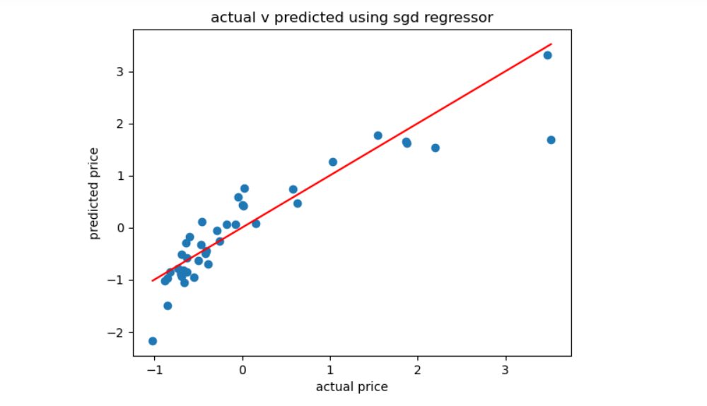

# BLENDED_LEARNING
# Implementation-of-Stochastic-Gradient-Descent-SGD-Regressor

## AIM:
To write a program to implement Stochastic Gradient Descent (SGD) Regressor for linear regression and evaluate its performance.

## Equipments Required:
1. Hardware – PCs
2. Anaconda – Python 3.7 Installation / Jupyter notebook

## Algorithm
1. Import necessary libraries (pandas, numpy, sklearn, matplotlib).
2. Load the dataset using pandas.
3. Preprocess the data:

   * Drop unnecessary columns (e.g., CarName, car\_ID).
   * Convert categorical variables using one-hot encoding.
4. Split the dataset into features (X) and target (Y), then into training and testing sets.
5. Standardize the features and target using StandardScaler.
6. Initialize the SGDRegressor model with appropriate parameters.
7. Train the model on the training data.
8. Predict the target values for the test data.
9. Evaluate the model using Mean Squared Error and R² score.
10. Display model coefficients and intercept.
11. Visualize actual vs predicted values with a scatter plot.
12. End of workflow.

## Program:
```
/*
Program to implement SGD Regressor for linear regression.
Developed by: THARUN N
RegisterNumber:  212225240173
*/
```
```
import pandas as pd
import numpy as np
from sklearn.model_selection import train_test_split
from sklearn.linear_model import SGDRegressor
from sklearn.metrics import mean_squared_error , r2_score ,mean_absolute_error
from sklearn.preprocessing import StandardScaler
import matplotlib.pyplot as plt
#load dataset
data = pd.read_csv('CarPrice_Assignment.csv')
print(data.head())
print(data.info())
#data processing
#dropping unnecessary columns and handling categorical variables
data = data.drop(['CarName','car_ID'],axis=1)
data=pd.get_dummies(data, drop_first=True)
#splitting data into features and target variable
x=data.drop('price',axis=1)
y=data['price']
#standardising the data
scaler = StandardScaler()
x= scaler.fit_transform(x)
y= scaler.fit_transform(np.array(y).reshape(-1,1))
#splitting the data set inot training and test data
x_train,x_test,y_train,y_test= train_test_split(x,y,test_size=0.2,random_state=42)
#creating the sgd regressor model
sgd_model=SGDRegressor(max_iter=1000,tol=1e-3)
#fitting the model on training
sgd_model.fit(x_train,y_train)

# making predictions
y_pred=sgd_model.predict(x_test)

#evaluating model performance
mse=mean_squared_error(y_test,y_pred)
mae=mean_absolute_error(y_test,y_pred)
r2score=r2_score(y_test,y_pred)
print("Name:Tharun N")
print("reg no:2122254240173")
print("mse:",mse)
print("mae:",mae)
print("r2score:",r2score)
print("\nmodel co efficients")
print("co-efficients",sgd_model.coef_)
print("intercept",sgd_model.intercept_)
#visualising actual v predicted
plt.scatter(y_test,y_pred)
plt.xlabel("actual price")
plt.ylabel("predicted price")
plt.title("actual v predicted using sgd regressor")
plt.plot([min(y_test),max(y_test)], [min(y_test),max(y_test)],color='red')
plt.show()
```    

## Output:



## Result:
Thus, the implementation of Stochastic Gradient Descent (SGD) Regressor for linear regression has been successfully demonstrated and verified using Python programming.
